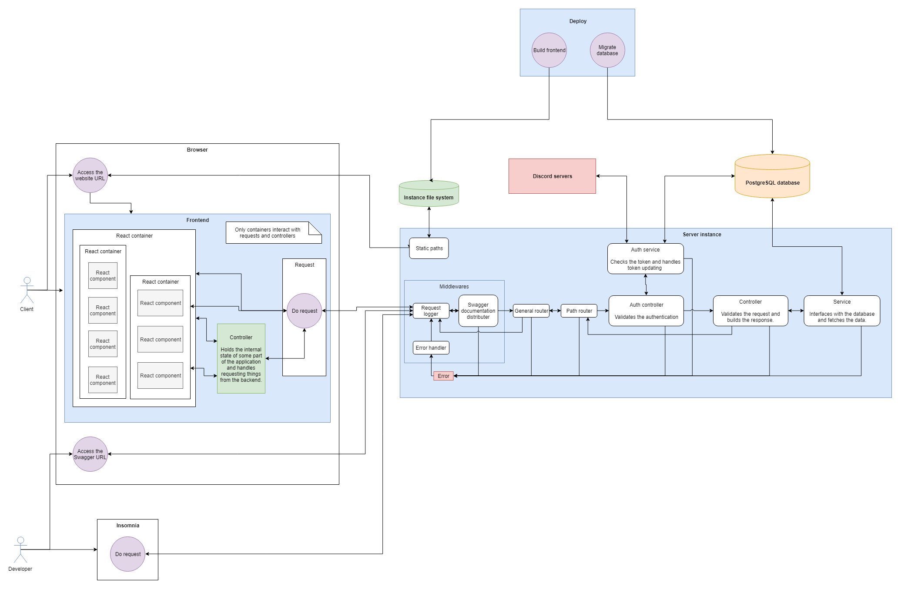

<<<<<<< HEAD
# ody-management-platform

A platform for ODY to manage its various operations and member involvement.

- [Trello board](https://trello.com/b/PXYEYzl4)
- [Design Trello board](https://trello.com/b/SmOJFAOT)
- [Google Drive folder](https://drive.google.com/open?id=14gg3ui4XqrCO1gVDanTQofxG7p33PN9h)

The rough (and possibly outdated) structure of the service:



## Requirements

- [Node.js](https://nodejs.org/en/) 8 LTS or newer
- [npm](https://www.npmjs.com/) 6.0.0 or newer

For the test environment:

- [Docker and Docker Compose](https://docs.docker.com/compose/install/)

**NOTE:** Some of the console commands in this documentation may not run in batch or Powershell! When developing on Windows, Git Bash or Linux subsystem is recommended.

If you're using Visual Studio Code, the following extensions are recommended:

- EditorConfig for VS Code (must have!)
- Docker
- ESLint
- npm
- vscode-icons (optional, needs to be activated separately)
- GitLens (optional, disabling some of the features is recommended)

## Installation

In order to install the dependencies, navigate to the project folder and run

```bash
npm install
```

## API documentation

When the Node.js server is running, the Swagger documentation can be viewed at path `/api/api-docs`.

### Starting the databases

This app uses PostreSQL and Redis databases to store its data. They can be hosted separately, but it's a lot easier to do this with a Docker container. To start the container, make sure that the Docker daemon is running and run

```bash
docker-compose up -d
```

In order to stop the container, run

```bash
docker-compose stop
```

In order to stop and destroy the container, run

```bash
docker-compose down
```

## Setting up the environment

Before running the application, you need to set up some environment variables so that the application knows where the database is and so on. Copy the environment variable sample file with

```bash
cp .env-sample .env.local
```

and fill in the correct environment variables. Then source the file with

```bash
source .env.local
```

Make sure that the database is migrated with

```bash
npm run migrate
```

## Run tests

```bash
npm test
```

## Run development

Ensure that the database is running and the environment has been set. Then start the server with

```bash
npm run watch
```

The development server detects saved changes and automatically refreshes the content.

## Run production

Ensure that the database is running and the environment has been set. Then start the server with

```bash
npm start
```

## Gaining permissions in development

If the development application tells you that you do not have permissions, you can make all users admins by running

```bash
npm run make-everyone-admins
```

## Seeding the database

You can fill the application with some dummy data by running

```bash
npm run seed
```
=======
# odymb
>>>>>>> 5ab444c39ca0637e7b2fa0850cb491949a659c2a
